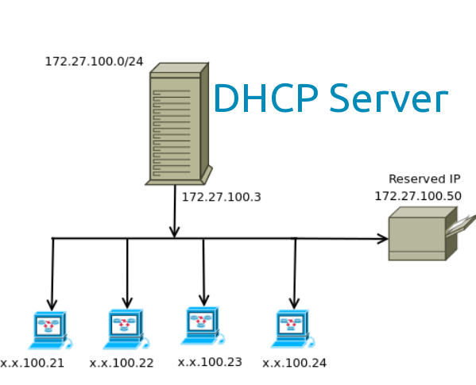
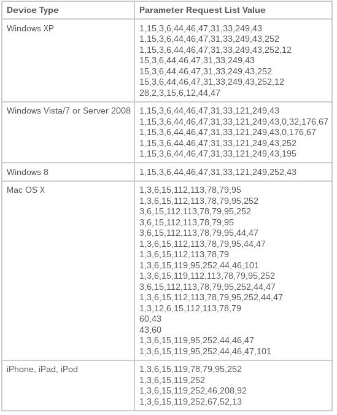
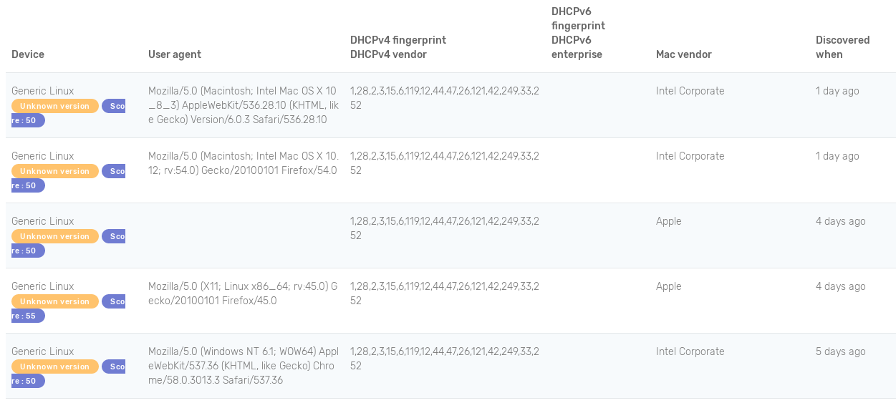
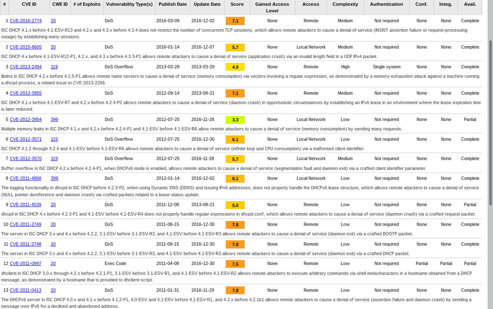
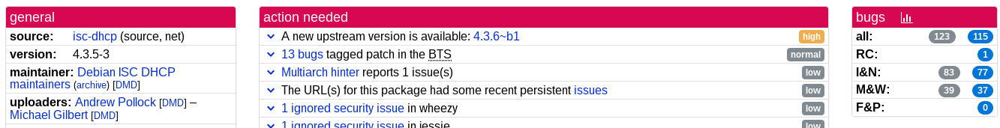
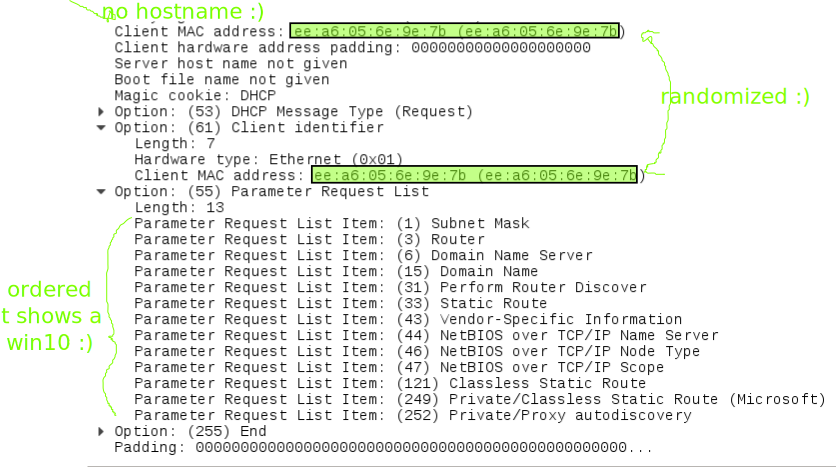
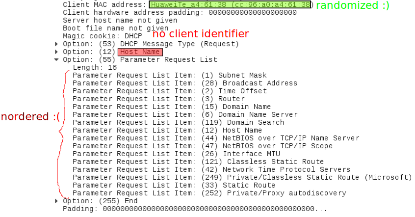
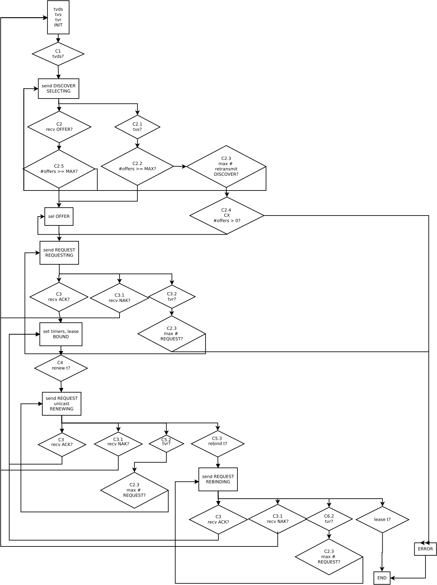

Get IP addresses leaking less identifying information
======================================================

juga at riseup dot net

https://github.com/dhcpap

Bornhack, Bornholm, 24th August 2017

----  ----

Contents
========

* What is DHCP
* Issues with DHCP
* `dhcpcfp`
* Solving DHCP issues
* Implementations issues
* `dhcpcanon`
* `systemd` DHCP client
* Future work
* Questions

----  ----

What is DHCP
============

Dynamic Host Configuration Protocol

    A DHCP server enables computers to request IP addresses and
    networking parameters automatically

    When a computer or other device connects to a network,
    the DHCP client software sends a broadcast query requesting
    the necessary information.
    Any DHCP server on the network may service the request.

[* Wikipedia *](https://en.wikipedia.org/wiki/Dynamic_Host_Configuration_Protocol)<!-- .element:  class="cite" -->

----

What is DHCP
-------------

----

What is DHCP
-------------

<!-- .element:  style="width: 30%; float:left" -->

1. my laptop: can i have an address?<!-- .element: class="fragment" data-fragment-index="0" -->
2. server:    i can offer you 192.168.1.23<!-- .element: class="fragment" data-fragment-index="1" -->
3. my laptop: i request 192.168.1.23<!-- .element: class="fragment" data-fragment-index="2" -->
4. server:    assigned to you!<!-- .element: class="fragment" data-fragment-index="3" -->

----  ----

Issues with DHCP
=================

1. my laptop: can i have an address?<!-- .element: class="fragment" data-fragment-index="0" -->
  * btw my device name is juga_laptop<!-- .element: class="fragment" data-fragment-index="1" -->
  * it's a Dell i bought in Copenhague in 2013<!-- .element: class="fragment" data-fragment-index="2" -->
  * i use Debian with dhclient version 4.3.5<!-- .element: class="fragment" data-fragment-index="3" -->
  * i like the coffee with milk<!-- .element: class="fragment" data-fragment-index="4" -->
2. server:    i can offer you 192.168.1.23<!-- .element: class="fragment" data-fragment-index="5" -->
  * btw, you can find milk in the fridge<!-- .element: class="fragment" data-fragment-index="6" -->

----

Device fingerprinting
----------------------

<!-- .element:  style="width: 20%;" -->

    A device fingerprint or machine fingerprint or browser fingerprint is
    information collected about a remote computing device for the purpose of
    identification.
    Fingerprints can be used to fully or partially identify individual users
    or devices even when cookies are turned off.

[* Wikipedia *](https://en.wikipedia.org/wiki/Dynamic_Host_Configuration_Protocol)<!-- .element:  class="cite" -->

----

Some DHCP fingerprintable options
----------------------------------

* **MAC** address (hardware, link-layer layer):
  not specific of DHCP, it can not be removed, but can be randomized
* **hostname**: can identify a device or an individual, not need to send it
* **client identifier**: MUST be unique in the subnet,
  it can be the MAC since it's sent anyway
* **Parameter Request List** (PRL): specific to the operating system (OS), client and version

----

DHCP fingerprint databases
------------------------------

[DHCP Parameter Request List Option 55 Used to Profile Endpoints](http://www.cisco.com/c/en/us/support/docs/security/identity-services-engine/116235-configure-ise-00.html)

----

DHCP fingerprint databases
------------------------------

[fingerbank](https://fingerbank.org)

    PacketFence's sister project.
    A vast collection of device fingerprints to identify the devices
    connected to your network.

1968 DHCP fingerprints!!!

----

fingerbank example
--------------------

----

``dhcpcfp``
-------------

``dhcpcfp`` scans the DHCP client REQUEST packet and creates a report
with the fingerprinting data found, the differences of that data with
``dhcpcanon`` and how to avoid to be fingerprinted through DHCP.

* From the same machine that sends a DHCP packet
1. Obtain a DHCP Request packet scanning in active network interface.
2. Query a database with DHCP fingerprints
3. Generate a report with the datapoints found, the guessed devices/
   operating system and recommendations on DHCP clients less fingerprintable.
* A machine that scans for DHCP packets in the local network
* Providing a pcap file
* Providing a DHCP fingerprint

----  ----

Solving some DHCP issues
=========================

Ideas
------

* to avoid individual fingerprinting
  * no hostname
  * no personalized options
* to avoid device/OS fingerprinting
  * implementations must be similar
  * no OS nor device specific options

----

RFC 7844
---------

[Anonymity Profiles for DHCP Clients](https://tools.ietf.org/html/rfc7844) (2016)

    Some DHCP options carry unique identifiers.
    These identifiers can enable device tracking even if the device administrator
    takes care of randomizing other potential identifications
    like link-layer addresses or IPv6 addresses.
    The anonymity profiles are designed for clients that
    wish to remain anonymous to the visited network.
    The profiles provide guidelines on the composition of DHCP or DHCPv6 messages,
    designed to minimize disclosure of identifying information.

----

RFC 7844
---------

* Recommends to do not use some packet options and restrict the value of others
* Gives flexibility to the implementer (but more identifying possibilities)
* No specification on logic that could be fingerprintable, as retransmission delays
* Windows 10 (mobile and desktop) implements it for Wifi devices,
  when enabling hardware randomization

----  ----

Existing implementations
========================

----

We could just modify existing implementations...

**but**<!-- .element: class="fragment" data-fragment-index="0" -->

----

Vulnerabilities
----------------

`dhclient` [ISC DHCP, CVEs](https://www.cvedetails.com/vulnerability-list.php?vendor_id=64&product_id=17706)

----

Bugs
------

[Debian tracker, isc-dhcp](https://tracker.debian.org/pkg/isc-dhcp)

Note:
Vulnerabilities and bugs:
ISC DHCP client, `dhclient`
* [Debian isc-dhcp-client bugs](https://bugs.debian.org/cgi-bin/pkgreport.cgi?package=isc-dhcp-client)
* [Debian security tracker](https://security-tracker.debian.org/tracker/source-package/isc-dhcp)
* [ISC DHCP CVEs](https://www.cvedetails.com/vulnerability-list.php?vendor_id=64&product_id=17706)
* [Debian isc-dhcp package](https://packages.qa.debian.org/i/isc-dhcp.html)
* [ISC DHCP client CVEs](
https://www.cvedetails.com/product/610/ISC-Dhcp-Client.html?vendor_id=64) ,
* [ISC DHCP client CVEs in NIST site](https://nvd.nist.gov/vuln/search/results?adv_search=true&form_type=advanced&results_type=overview&cpe_vendor=cpe%3a%2f%3aisc&cpe_product=cpe%3a%2f%3aisc%3adhcp_client),
* [ISC DHCP CVEs in ISC site](https://kb.isc.org/category/75/0/10/Software-Products/DHCP/Security-Advisories/)
* https://bugs.debian.org/cgi-bin/pkgreport.cgi?archive=both;include=subject%3Ahostname;package=isc-dhcp-client

----

Configuration options not flexible enough
------------------------------------------

Difficult to just not send hostname...

* [Debian Bug #792854, isc-dhcp-client: Dhclient fails to set hostname](https://bugs.debian.org/cgi-bin/bugreport.cgi?bug=792854)<!-- .element: class="fragment" data-fragment-index="0" -->
* [Tails Bug #7688, DHCP client leaks hostname "amnesia"](https://labs.riseup.net/code/issues/7688)<!-- .element: class="fragment" data-fragment-index="1" -->
* [Gnome networkmanager mailing list, Re: dhclient: avoiding hostname disclosure via DHCP request](https://mail.gnome.org/archives/networkmanager-list/2014-January/msg00024.html)<!-- .element: class="fragment" data-fragment-index="2" -->
* ...<!-- .element: class="fragment" data-fragment-index="3" -->

----

...

    [...]
    As you are probable aware, NM has a per-connection setting
    "ipv4.dhcp-send-hostname" to control this.
    You are now asking for a global configuration override/default.

    This is currently not possible, but should be.

* <a href="https://bugzilla.gnome.org/show_bug.cgi?id=768076#c5">Gnome Bug 768076</a>

----

<!-- .element:  style="width: 40%;" -->

----

Security
----------

What about apparmor?

    Date: Fri, 14 Aug 2015 11:16:53 +0200
    [...]
    dhclient typically runs as root, is meant to access the network, and
    has had grave security issues in the past (e.g. CVE-2011-0997,
    CVE-2009-0692, CVE-2000-0585), so it feels like it should one of the
    highest priority target for AppArmor confinement in Debian.

    Ubuntu has been confining dhclient with AppArmor since more than
    6 years (9.04).
    [...]

* <a href="https://bugs.debian.org/cgi-bin/bugreport.cgi?bug=795467">Debian Bug * #795467</a>

----  ----

Yet another DHCP client
========================

----

Implementation decisions
---------------------------

Follow Windows 10 implementation or the RFC in the more restrictive way?

----

Implementation decisions
---------------------------

Let's all look like Windows!

<!-- .element:  style="width: 120%;" -->

IETF slides [DHCP Anonymity Profile Update](https://www.ietf.org/proceedings/93/slides/slides-93-dhc-1.pdf)

----

----

Windows 10 capture
-------------------

----

dhclient capture
-----------------

----

`dhcpcanon`
------------

 

* no C code
  * `/* nor C associated issues...;) */ */`
* simple
* integrates and removes privileges with `systemd`
* integrates with `network-manager` (nm)
* does not implement "default behavior"
  * no way to send hostname even if nm does not have a default way to disable it

[documentation](https://dhcpcanon.readthedocs.io), [source](https://github.com/juga0/dhcpcanon)

----

Organigram
------------

<!-- .element:  style="width: 40%;" -->

----

Minimizing dhcpcanon privileges
--------------------------------

Privileges needed for:

* open sockets in privilege ports (68)
* open RAW sockets: to receive packets without having an IP set yet
* to set the IP offered

----

Possible approaches to minimize privileges
-------------------------------------------

* drop privileges after BOUND DHCP state (sockets binded),
  but then no privileges to continue with RENEWING nor REBINDING
* wrapper with privileges to set linux network capabilities to the client,
  open sockets, then call the client inheriting the sockets
* ``dhcpcanon`` could call a binary with privileges to create the sockets
   every time it needs to do so.
* have the process be granted just the capabilities it needs,
  by the system-level process manager (``systemd``). Done
* wrapper to do the same without the system-level process manager. To be done
More details: [Minimizing privileges](https://dhcpcanon.readthedocs.io/en/latest/privileges.html)
----

Start using it today
---------------------

    apt install dhcpcanon

And give feedback...

----  ----

`systemd` DHCP client
=====================

----

why `systemd`?
---------------

cauz i know you ♥ it 😋<!-- .element: class="fragment" data-fragment-index="0" -->

----

why `systemd`?
------------------

* becaming default system manager in Linux<!-- .element: class="fragment" data-fragment-index="1" -->
  * more anonymity set<!-- .element: class="fragment" data-fragment-index="2" -->
* still C code, but<!-- .element: class="fragment" data-fragment-index="3" -->
  * not obfuscated!<!-- .element: class="fragment" data-fragment-index="4" -->
* it already implements "default behavior"<!-- .element: class="fragment" data-fragment-index="5" -->
  * and it's easy to add the anonymity profiles behavior<!-- .element: class="fragment" data-fragment-index="6" -->

----  ----

What about other network layers?
=================================

----

Still fingerprintable
-------------------------

:(

    OSI Layer 7: SMB, FTP, HTTP, Telnet, TLS/SSL, DHCP[9]
    OSI Layer 5: SNMP, NetBIOS
    OSI Layer 4: TCP (see TCP/IP stack fingerprinting)
    OSI Layer 3: IPv4, IPv6, ICMP, IEEE 802.11[7]
    OSI Layer 2: CDP[10]

[*Wikipedia*](https://en.wikipedia.org/wiki/Device_fingerprint#OSI_model_fingerprints)

----  ----

Future Work
===========

----

Replace all the Internet protocols!
------------------------------------

<!-- .element:  style="width: 40%;" -->

----

``dhcpcanon``
---------------

* more testers!
* ``apparmor`` profile
* IPv6
* wrapper with privileges to bind sockets when not using systemd
* new Debian package version

----

``Gnome Network Manager``
---------------------------

* proper integration

----

``systemd``
-------------

* get the pull request accepted
* IPv6
* ideally the anonymity profiles could be the default

----

Better operating systems integration
-------------------------------------

* Include it in your favorite Linux based distribution (Tails, Subgraph OS, Qubes)

<!-- .element:  style="width: 10%;" -->
 <!-- .element:  style="width: 20%;" -->
 <!-- .element:  style="width: 20%;" -->

----

Others
-------

- domain and Web page to facilitate finding documentation (WIP)
- Raspberry Pi image for demonstration purposes

<!-- .element:  style="width: 150px;" -->

----

Other operating systems implementations
------------------------------------------

<!-- .element:  style="width: 150px;" -->
 
 

* Android
  * MAC randomization
  * DHCP client

----  ----

Questions?
==========

----  ----

Thank you very much!
======================

Many people for their very valuable ideas and suggestions.

The authors of the RFC 7844,
the [Prototype Fund Project](https://prototypefund.de) of the
[Open Knowledge Foundation Germany](https://okfn.de/) and the
[Federal Ministry of Education and Research](https://www.bmbf.de/)
for funding partially this project.

<!-- .element:  style="width: 10%;" -->
 <!-- .element:  style="width: 10%;" -->

----  ----

Contact
==========

juga at riseup dot net

2DA8 1D01 455C 3A00 3219  8850 F305 447A F806 D46B

IRC: #dhcpcanon at havana.baconsvin.org:6697

----  ----

And now...
===========

Happy bug hunting!

<!-- .element:  style="width: 40%;" -->
